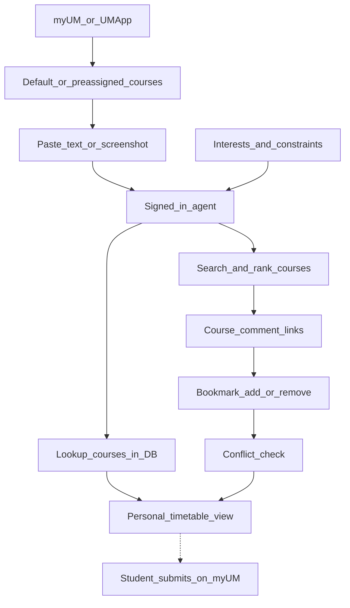
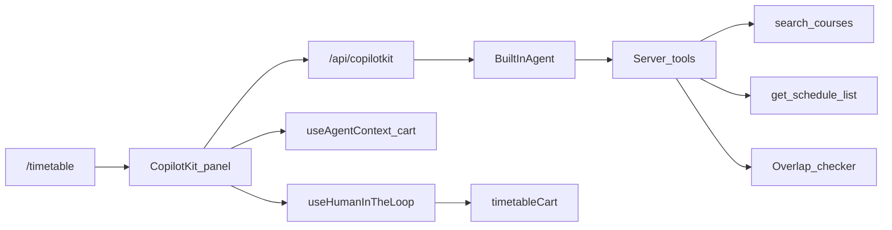

# AI 选课课表助手：讨论定稿

> 状态：**讨论定稿，未开工**。本文是这次讨论的最终记录，供后续开独立 V1 实施方案时对照。
> 最后更新：2026-09-21

---

## 0. 决策一览

已经对齐、不必再辩的：

- 三个核心对象：目标课表、评价、备选名单
- 课表工作台：`/timetable` 上展开面板，改完立刻看到周历（主战场）
- 领域逻辑本站自建（搜课、排课、冲突）；模型只理解意图、调工具、讲人话
- 课表改动必须学生确认（HITL）
- 文字粘贴优先，截图后做
- 先修没有官方数据就只做软提示，不硬拦
- CopilotKit 作 agent UI 层，自托管 runtime
- 走 OpenRouter，换模型只换字符串
- 按约 10,000 本科生、用得很多来估：未优化重度约 $1,600–6,000 / 季（Qwen），最坏踩阶梯约 $21,000；第一批优化约 $1,600–2,000，再让加减课绕过模型约 $1,000–1,300；硬顶按日封


| 事项          | 倾向                                                               | 为什么还没锁                      |
| ----------- | ---------------------------------------------------------------- | --------------------------- |
| V1 范围       | 文字导入 + 可视化 + 搜课 + 评价链接 + 加删确认 + 时间冲突 + 本地收藏                      | 需要拍板是否接受「截图 / 先修 / 账号同步」都推迟 |
| 强制登录        | 是（用助手必须 Clerk）                                                   | 和「加退选慌的时候先贴一张课表」有张力；成本上必须登录 |
| Agent UI    | CopilotKit 官方 sidebar + shadcn 课程/确认卡                            | 视觉不够再换 headless，不必现在定       |
| 模型          | 三选一待 eval：Qwen3.7 Flash / GLM 5.3 Flash / DeepSeek V4 Flash 0731 | 必须自测工具调用，不能看榜               |
| 兜底模型        | Gemini 2.5 Flash Lite                                            | 真正 JSON Schema 强制           |
| 开源退路        | GLM 4.7 Flash                                                    | 取代 Granite                  |
| 部署          | Vercel 主路径                                                       | Cloudflare 流式未实测            |
| 课表 / 收藏     | V1 继续 `localStorage`                                             | 跟账号走要新表，可后做                 |
| 对话历史        | V1 不持久化                                                          | 决定是否新增 Supabase 表           |
| 预注册 / 加退选切换 | 按 `IS_PREENROLLMENT_OPEN` 自动切语气，允许手动覆盖                           | 现有开关只是徽章，不是状态机              |
| 全站入口        | **课表上展开，其它页收成小入口**；点开后再懒加载 CopilotKit                            | 收起放导航还是 FAB、V1 是否上全站，还没锁    |


明确推迟：

- 截图识课（V1.5）
- 先修硬校验
- 服务端课表同步、跨设备
- 对话历史落库
- 同学对课表
- 查名额 / 预测 batch / 代提交（永久不做）

---

## 1. 这个功能是什么

在 `/timetable` 旁边加一个选课规划搭档：学生把 myUM 的预分配课倒进来，立刻看到一周课表；再用口语换课、看评价、加删课、查冲突，整理出一份想提交的课表，以及一轮没中时的 Plan B。

不是假 myUM，也不是「尽量代劳」的全能 agent。

三个核心对象：

- **目标课表** — 这学期想提交的那一版
- **评价** — 每门课都能跳到 `/reviews/[code]/[prof]`，看完再决定
- **备选名单** — 加退选某轮没中时的 Plan B（比「只有一张理想表」更贴近每日 batch）

What2Reg 已经解决「这课 / 这教授值不值得上」。缺的是把评价嵌进排课。

---

## 2. 产品边界

本站是 **What2Reg @ UM（澳大選咩課）**：课程评价 + 课表模拟器，**不是** myUM / UM App。

助手能做：

- 识别学生贴进来的默认课（文字优先，截图次之）
- 在本站 DB 查课、画课表、按兴趣搜课
- 给出评价页链接
- 收藏、加入 / 移出本站课表、检查时间冲突

助手不能做：

- 替学生在官方系统加退选或预注册
- 查名额、抽签结果、某一轮 batch 是否中签
- 保证先修规则与官方一致（本站没有先修数据）

学生仍要自己去官方系统提交：

- [Pre-Enrolment](https://reg.um.edu.mo/current-students/enrolment-and-examinations/course-enrolment/pre-enrolment/)
- [Course Add/Drop](https://reg.um.edu.mo/current-students/enrolment-and-examinations/course-enrolment/course-add-drop/)

**这条边界必须出现在 UI 上**，不能只写在文档里。

---

## 3. UM 的两个选课窗口

产品在这两段时间的形态不一样。

**预注册（Pre-Enrolment）**

2026/2027 第一学期：2026-04-27 至 2026-05-03。非先到先得，但不做就失去加退选前的优先权。入口是 UM App / myUM → Pre-enrolment。

对本站：更像「发现 + 短名单」。课表时间往往还不完整（运营上预注册 Excel 与加退选 Excel 字段不同），冲突检测价值低，**收藏和心愿单更重要**。

**加退选（Add/Drop）**

2026/2027 第一学期：2026-08-10 16:00 – 2026-08-26 10:00。在校生 12 轮；新生从 08-13 开始共 9 轮。每日 batch：当天 16:00 至次日 10:00 提交，次日 16:00 出结果。学生一开始会看到**预分配默认课**，再自己改。

对本站：这是主战场——导入默认课 → 可视化 → 换课 → 冲突检查 → 留备选。连续十几天每天都要改一次志愿。

代码里的 `IS_PREENROLLMENT_OPEN` 只用来在评价页隐藏 "Offered" 徽章，**不是**学生选课状态机。助手可以借用它切换语气，但不能假装能查官方结果。官网每日 round 最多做日历提醒。




---

## 4. 澳大学生视角（意见，可改）

方向对，原故事略偏「agent 包办」。澳大选课痛点是季节性、短、狠：预注册一周不搞就丢优先权；加退选连续十几天每天 batch，预分配课常常要改，myUM 又不好用。What2Reg 已经解决「这课 / 这教授值不值得上」；缺的是把评价嵌进排课，而不是再做一个能替你提交的选课机器人。

### 真正会反复用的闭环

1. 把预分配 / 当前课倒进本站，立刻看到一周（加退选开场最有价值）
2. 用口语换课：「这个 GE 太难 / 不要早八 / 想空周五 / 换个评分更好的教授」
3. 点进评价页看完再决定（这是本站相对 myUM 的独特优势）
4. 撞时间就换 section 或换课，而不是闷头加进购物车
5. 留备选名单：第一轮没中，第二天还有 Plan B

原故事里的截图导入、搜课、评价链接、加删、冲突，都贴合这个闭环。**收藏比先修检查更贴加退选现实**——每天出结果后要马上改志愿。先修很重要，但学生自己也常搞不清官方 SharePoint；没有数据就硬查，会害人。

### 原故事没写、但学生每天在想的

- 时间偏好：不要 08:30、不要连堂、空周五下午、留午饭空隙
- 学分负荷：常见 15–18，超了要警告（不必做成官方校验）
- 用 GE / 必修 / 选修 思考，不只是课号
- 同一门课换教授（What2Reg 的核心资产）
- 授课语言、出勤严不严、GPA 是否友好（已有评分字段）
- 目标课表 + 备选课表，不是只有一张「理想表」
- 和同学对一下有没有课可以一起上（可后做）

### 不该做、或会反感的

- 假装能代提交、查名额、预测明天 batch 能不能中
- 没确认就改课表；识图 / 课号必须学生点确认
- 加退选慌的时候强制登录才能贴一张预分配截图（登录用来同步到手机 / 电脑更合理；**防账单则必须登录**——这两条张力见 §0）
- 先修数据不完整却说「你不能选这门」

### 已采纳的产品形状

- `/timetable` 上展开助手，改完立刻看到周历（主工作台）
- 其它页可以收成一个小入口，而不是再做一个全能全站机器人
- 文字粘贴优先，截图作为加分（myUM 复制往往比照片准）
- 每张课卡片：加课表 / 收藏备选 / 开评价
- 冲突做成硬拦；先修做成「本站暂无官方先修数据」的软提示
- 预注册期主打短名单；加退选期主打「默认课 → 改表 → 备选」

### 入口：课表工作台 + 全站收起（新讨论）

只放 `/timetable` 会断掉闭环：学生从目录、搜索、评价页看完课，人已经不在课表页，还要自己记着课号再回去。全站常驻展开则容易变成「什么都能问」的机器人，而且日历不在眼前时加课又会闷头进购物车。

**建议：两种形态，一个 agent。**


| 页面                 | 形态                 | 适合干什么                      |
| ------------------ | ------------------ | -------------------------- |
| `/timetable`       | 展开的侧栏 / 面板         | 导入默认课、看冲突、改目标课表、整理备选       |
| 目录 / 搜索 / 课程 / 评价  | 收起的小入口（导航角标或右下角芯片） | 「这门冲不冲突」「收藏备选」「换个教授」「打开评价」 |
| `/timetable` 上再点收起 | 回到小入口              | 给日历腾位置                     |


页面要喂给 agent 当前上下文：评价页就是这门课 + 这个教授，目录页就是这个学院 / GE。加课、删课仍然走确认卡。在非课表页加课成功后，给一句「去课表看这一周」，不要假装日历已经在旁边。

技术上**不要把 CopilotKit 静态挂进 `app/layout.tsx`**。全站只放一个几 KB 的触发器；第一次点开再 `dynamic(..., { ssr: false })` 拉 runtime。否则首页、目录、评价都会吃到刚从 `/timetable` 减下来的 bundle。

V1 可以先只做课表展开面板，全站小入口放 V1.1——实现成本主要是入口和页面上下文，不是第二套 agent。如果 V1 就上全站，也必须是收起态，不能默认展开。

### 能力清单（记录用，不锁定版本）

1. 登录后使用助手
2. 导入默认课：文字粘贴或截图 → 识别课号 / section / 教授
3. 回库并画课表：复用 `get_schedule_list` + 现有日历
4. 自然语言搜课：兴趣、时间偏好、学分、GE、难度
5. 评价入口：结果带 `/reviews/[code]/[prof]`
6. 收藏（本站目前没有）
7. 加入课表：写 `timetableCart`
8. 时间冲突检测（先修另说）
9. 替代建议：换 section 或换相近课
10. 移除课程
11. 预注册模式：侧重点从「改默认课表」变成「列短名单」

---

## 5. 现有代码盘点

### 可以直接复用


| 能力    | 位置                                                                                                                                                                                  |
| ----- | ----------------------------------------------------------------------------------------------------------------------------------------------------------------------------------- |
| 课程目录  | `course_noporf`，类型见 [lib/database/types.ts](../lib/database/types.ts)                                                                                                               |
| 开课与时间 | `offer` + `schedule` + `time_location`，RPC 封装在 [lib/database/get-schedule-list.ts](../lib/database/get-schedule-list.ts)                                                            |
| 搜索    | RPC `search_courses` / `search_instructors_with_courses`，见 [lib/database/get-fuzzy-search.ts](../lib/database/get-fuzzy-search.ts)                                                  |
| 评价与评分 | `prof_with_course` 聚合分（result / grade / hard / reward / attendance）+ `/reviews/[code]/[...prof]`                                                                                    |
| 课表 UI | [app/timetable/page.tsx](../app/timetable/page.tsx)、[components/timetable-calendar.tsx](../components/timetable-calendar.tsx)、[lib/timetable-events.ts](../lib/timetable-events.ts) |
| 限流    | [lib/rate-limit.ts](../lib/rate-limit.ts) + RPC `consume_rate_limit`                                                                                                                |
| 登录    | Clerk v4 `authMiddleware`                                                                                                                                                           |


### 缺失（这个功能依赖的）

- 任何 AI / chat / tool-calling（`package.json` 里没有）
- **时间冲突检测**——日历只负责渲染，时间重叠照样能加进购物车
- 收藏 / 心愿单
- 先修、依赖、学分上限、年级限制
- 课表与账号同步（目前只有 `localStorage` 的 `timetableCart`）
- 截图识课
- 官方名额、预分配名单、每天加退选结果（永远拿不到）

### 两个实现时会绊脚的细节

`**search_courses` 不搜中文标题。** RPC 只对 `New_code` 和 `courseTitleEng` 做 `ilike`，`courseTitleChi` 不在里面。学生用中文课名问，现有搜索命中不了——要么改 RPC，要么在工具层补一条中文检索路径。

**购物车条目没有冲突约束。** 形状大致是 `{ section, schedules: [{date, time, location}], code, prof, color }`。同一 `code` + `section` 不能重复加，但时间撞车不拦。

---

## 6. 架构

领域逻辑全部留在本站 TypeScript。**不让模型自己编课号或时间。**




工具划分（名称可改，数量控制在 5–8 个）：

- **服务端**：`search_courses`、`get_sections_and_schedule`、`check_conflicts`、`suggest_alternatives`
- **前端**：`add_to_timetable`、`remove_from_timetable`、`bookmark_course`
- **HITL**：导入、加课、删课一律先出确认卡，学生点了才落地

UI：`/timetable` 上展开面板是主路径；其它页用收起的小入口，不是独立助手页，也不是默认展开的全站大窗。

课程卡 / 冲突卡 / 确认卡用 shadcn。聊天壳先用 CopilotKit 官方 sidebar 跑通，视觉不够再换 headless。

---

## 7. CopilotKit

**结论：适合作为 agent UI 层，不要当「选课大脑」。**

这个助手要看见当前课表、改购物车、弹确认框、把搜课结果渲染成本站卡片。CopilotKit 正好覆盖这套 in-app copilot：

- `useAgentContext` — 把购物车、学分合计、当前模式喂给模型
- `useFrontendTool` — 加课删课直接打到 React / localStorage
- `useHumanInTheLoop` — 对齐「没确认不改课表」
- 生成式 UI — 搜课结果、冲突、备选渲染成卡片而不是 markdown
- 多模态附件 — 截图有现成支持，默认 base64 内联
- 自托管 `/api/copilotkit`，MIT 许可

和自己用 Vercel AI SDK 搭相比：AI SDK 更轻、更「Next 原生」，也有 Agent 和 tool approval，但「读 React 状态 + 前端改购物车 + 确认卡」要自己拼。差异化在课表、评价、冲突，不在聊天协议，用 CopilotKit 换速度合理。

### 兼容性（已核实）

`@copilotkit/react-core@1.73.0` 的 peer 依赖是 `react: ^18 || ^19`、`zod: >=3.25`。本仓库锁的是 React 18.3.1、zod 3.25.76，**都满足，不需要升级 React**。

### 不该用它做的

- 搜课、排课、冲突判断——仍是本站 TypeScript
- 不要一上来就上 Copilot Cloud 或 LangGraph；自托管 runtime + BuiltInAgent 够第一版
- 默认聊天皮肤和 shadcn 不一致，需要主题化

### 落地要点

- 钉 v2 API（`CopilotKitProvider`、`useFrontendTool`、`useAgentContext`、`useHumanInTheLoop`），不要混用已弃用的 v1 `useCopilotAction`
- 不要把 CopilotKit 静态挂进 `app/layout.tsx`。全站最多放一个懒加载触发器；Provider 在用户点开后才挂上，课表页可以直接展开
- Runtime 放 `app/api/copilotkit/[[...slug]]/route.ts`
- 用 `createOpenAI({ baseURL: "https://openrouter.ai/api/v1" })` 接 OpenRouter，换模型只换字符串
- 课程卡 / 冲突卡 / 确认卡用 shadcn
- 聊天壳先用官方 sidebar 跑通

---

## 8. 基础设施

CopilotKit 本身冲击不大。真正改变的是三件事：第一条长连流式路由、第一个按量计费的外部依赖、第一个必须鉴权的 `/api` 端点。

### 8.1 鉴权（最高优先级，也是钱的问题）

[middleware.ts](../middleware.ts) 目前把 `"/api/(.*)"` 整段列进 `publicRoutes`。照这个配置，`/api/copilotkit` 一上线就是**公开的、可无限调用的 LLM 端点**，等于把模型账单挂在公网上。

必须把 agent 路由从 `publicRoutes` 摘出来，并在 handler 里显式 `auth()`。**要求登录是最便宜的防滥用手段。**

### 8.2 限流（改动很小，必须做）

`consume_rate_limit` 的 RPC 签名只有 `target_key / window_seconds / max_hits`，加一个 `agent` action 只是改 TS 联合类型加一个环境变量，**不用动 SQL**。

建议两层：每用户每小时消息数 + 全局每日预算上限（到顶降级为纯搜索）。

### 8.3 部署：两边表现不同

仓库里 Cloudflare 链路是真的（[wrangler.jsonc](../wrangler.jsonc) 有实际 D1 database_id、R2 增量缓存、Images binding）。

- **Cloudflare Workers**：2026-09 起体积上限放宽到 64 MiB 未压缩，打包已不是障碍；HTTP 请求没有硬性 wall time 上限；CPU 只按实际执行计费，流式转发很省。**但 Free 档每次调用只有 10ms CPU**，agent 循环撑不住，实际上线需要 Paid（$5/月起）。
- **Vercel**：Fluid compute 下 Hobby 上限 300s、Pro 可配到 800s，够用。坑在计费——等模型输出时 Active CPU 暂停计费，**Provisioned Memory 却一直计**。长对话流会持续占内存计费。

**建议 Vercel 作主路径**，Cloudflare 那条等流式实测过再说。

### 8.4 Bundle：会撞上刚做完的优化

[docs/superpowers/verification/2026-09-19-ssr-bundle.md](superpowers/verification/2026-09-19-ssr-bundle.md) 记录 `/timetable` 刚从 `410 kB route / 555 kB First Load` 降到 `3.46 kB / 149 kB`。静态引入 CopilotKit 等于把这轮成果吐回去。

做法应与现有 scheduler 一致：`dynamic(..., { ssr: false })`，用户点开助手才加载。

### 8.5 新增的状态与密钥

- 模型 API key（Cloudflare 侧注意 `keep_vars: true` 与 secrets 管理）
- 对话线程：BuiltInAgent 自托管默认不持久化。要历史记录就得新建 Supabase 表
- 截图附件：默认 base64 内联会让请求体变大，要走存储可以复用 `BLOB_READ_WRITE_TOKEN` 或 R2

### 8.6 隐私与合规（会卡上线）

学生上传的 myUM 截图里很可能有**学号、姓名、班级**，而这些会发给第三方模型厂商（经 OpenRouter 转到 Alibaba / DeepInfra / CoreWeave 等）。站内已有 `/privacy-policy`，需要相应更新，并在上传处提示可以先打码。

这也是**文字粘贴优先于截图**的又一个理由——myUM 复制出来的文本往往比照片更准，也更干净。

含个人信息的请求必须固定 provider 并配数据保留策略，**不能用默认路由**。部分 OpenRouter 免费模型明确会拿输入输出去训练 → 截图绝对不能走免费档。

### 8.7 其它

- Supabase 读放大：一轮对话可能扇出多次 RPC，都是便宜读，高峰期值得加缓存
- CI 不变（lint / tsc / vitest）
- 依赖面变大：agent UI + 模型 SDK 是新的供应链面

---

## 9. 成本

### 软件许可：$0

CopilotKit 开源部分 MIT，自托管 runtime 不收费。Copilot Cloud 免费档只有 1 个开发者 / 200 线程 / 3 天保留，撑不住真实学生流量；Pro $39/月，Team $100/席/月。**自托管，跳过 Cloud。**

### 模型 token（主要开销）

人口口径：**澳大本科约 10,000 人**。下面两档都假设学生**用得很多**。若实际只有一半人用助手，整表约减半。

单价（per 1M tokens，2026-09-21 标价，**不用促销价**）：

| 模型 | 输入 / 输出 |
|---|---|
| Qwen3.7 Flash ≤32K | $0.03 / $0.13 |
| Qwen3.7 Flash 32K–256K | $0.10 / $0.40 |
| DeepSeek V4 Flash 0731 | $0.04 / $0.16 |
| GLM 4.7 Flash | $0.06 / $0.40 |
| GLM 5.3 Flash | $0.075 / $0.25 |
| DeepSeek V4.1 Flash | $0.12 / $0.48 |
| Gemini 2.5 Flash Lite | $0.10 / $0.40 |
| Claude Haiku 档（误升档） | ~$1 / $5 |

Qwen3.7 Flash cache read 约 $0.006。截图本身便宜（约 1,300–2,000 图像 token / 张）。贵的是**长对话把历史越积越长**，以及踩中 32K 阶梯。

#### 用量假设（1 万本科、用得很多）

加退选 16 天 / 12 轮，预注册约 7 天。

| 档 | 学生 | 每人本季会话 | 每会话 | 本季总会话 | 含义 |
|---|---:|---:|---|---:|---|
| **重度** | 10,000 | 15（预注册 3 + 每轮加退选 1） | 25 轮 × 均 12k 入 / 500 出 = 300k / 12.5k | 150,000 | 几乎人人用，每轮出结果都回来改 |
| **最坏** | 10,000 | 24（两个窗口几乎每天来，出结果日来两次） | 35 轮 × 均 22k 入 / 700 出 = 770k / 24.5k | 240,000 | 上一条 + 不裁历史 + 上下文常到 20k–40k |

最坏档默认：经常跨过 Qwen 32K 阶梯、无 prompt caching、无每日封顶。这是**用来定上限的数，不是期望账单**。

#### 未做优化时的整季账单

| 模型 | 重度 | 最坏（都 ≤32K） | 最坏（都进 32K–256K） |
|---|---:|---:|---:|
| Qwen3.7 Flash | ~$1,600 | ~$6,300 | ~$21,000 |
| DeepSeek V4 Flash 0731 | ~$2,100 | ~$8,300 | （无此阶梯，仍约 $8,300） |
| GLM 4.7 Flash | ~$3,500 | ~$13,400 | （无此阶梯） |
| GLM 5.3 Flash | ~$3,800 | ~$15,300 | （无此阶梯） |
| Gemini 2.5 Flash Lite | ~$5,300 | ~$21,000 | （同左） |
| DeepSeek V4.1 Flash | ~$6,300 | ~$25,000 | （无此阶梯） |
| 误升到 Haiku 档 | ~$54,000 | ~$214,000 | — |

算法备查（最坏、Qwen 低档）：`240,000 × (770k × 0.03 + 24.5k × 0.13) / 1M ≈ $6,300`。全走进阶梯换成 $0.10 / $0.40 ≈ $21,000。

#### 单日尖峰（出结果 16:00）

1 万人当天人均 2 次会话 ≈ 20,000 会话。

- Qwen 低档：约 $530 / 天
- Qwen 进阶梯 / Gemini：约 $1,700 / 天
- 误升 Haiku：约 $18,000 / 天

#### 省钱手段（效率，按顺序叠，避免重复计算）

从「最坏 + 默认 Qwen + 已踩 32K 阶梯 ≈ $21,000」往下砍。每一步的「还能省」是相对上一步。

| 顺序 | 手段 | 做法 | 这一步约省 | 账单落到 |
|---|---|---|---:|---:|
| 0 | 未优化最坏 | 1 万人、长对话、踩阶梯 | — | **$21,000** |
| 1 | 默认锁在 Flash，禁止 Haiku | 运行时写死模型字符串，升档要人工改配置 | 相对 Haiku 最坏 $214k，避开约 **$193,000** | 仍 $21,000（Qwen 阶梯） |
| 2 | 单次请求压在 32K 内 | 裁历史 + 裁工具返回，挡住阶梯（$0.10/$0.40 → $0.03/$0.13） | **~$14,700（约 70%）** | **$6,300** |
| 3 | 只保留最近 8–10 轮历史 | 均输入 22k → 约 10k | **~$3,000（约 48%）** | **$3,300** |
| 4 | 工具返回裁剪 | 只回课号、标题、学分、时间、评分；不回 `courseDescription` / `ilo` | **~$600（约 19%）** | **$2,700** |
| 5 | Prompt caching | 系统提示 + 工具 schema 约 4k，cache read $0.006（约 2 折） | **~$800（约 30%）** | **$1,850** |
| 6 | 搜课 / 冲突 / 排课不交给模型算 | 已是架构默认；若让模型「想」排课，会回到第 0 步 | 守住成果，不是额外再减 | 维持 **$1,850** |
| 7 | 缩短系统提示 | 4k → 2.5k，且已被 cache | **~$50–80** | **~$1,800** |
| 8 | 截图才走视觉，日常纯文本 | 避免每轮都用更贵的多模态默认模型 | 相对「全程 Gemini」最坏再省约 **$3,000–6,000**；相对已用 Qwen 几乎为 0 | 维持 **~$1,800** |

叠完第一批后，期望大约 **$1,600–1,850**。下面这些**还没算进上表**，多数是「少让模型跑一轮」或「每轮少带废话」，可以再砍一截。

#### 还能再降的手段（第二批，从 ~$1,850 再往下）

按「值不值得做」排。省的是相对第一批做完之后的账单，不要和上表重复相加。

| 优先 | 手段 | 做法 | 为什么省 token | 相对 $1,850 大约再省 | 备注 |
|---|---|---|---|---:|---|
| P0 | 结构化操作绕过模型 | 卡片上的加入 / 移除 / 确认 / 换组，只走现有 `addToCart`，**不打 LLM** | 搜完之后的加减课往往占会话一半轮次 | **$350–550（约 20–30%）** | 第一批没写；产品上本来就该这样 |
| P0 | 课号 / 短指令不走模型 | `ACCT1000`、`加这门`、`删 CISG1000` 用正则或极小分类器直接调工具 | 少一整轮「理解 + tool call + 复述」 | 并进上一行 | 模型只处理真模糊的口语 |
| P0 | 禁止思考链 / 限制输出 | Qwen / GLM 的 thinking 按**输出**计费；`max_tokens` 300–400；系统提示写「一句结论 + 卡片，不要复述课表」 | 重度会话输出约 20k，压到 6–8k | **$150–250** | 开 thinking 会把 Flash 账单拉开一截 |
| P1 | 课表只传摘要 | `useAgentContext` 不要每轮丢整份 `timetableCart`；只传 `ACCT1000 Mon 08:30–09:45` 这种一行摘要，详情用工具再取 | 每轮少 1–3k 输入 | **$150–300** | 和「裁工具返回」不同：这是**请求里反复带的前端上下文** |
| P1 | 按场景挂工具，不要 8 个全挂 | 导入轮只挂 `import_from_text`；搜课轮挂 `search_courses`；加减课挂 `add/remove` | 工具 schema 往往比系统提示还长 | **$80–150**（cache 未命中时更多） | cache 命中后省得少，但能帮挡住 32K |
| P1 | 旧工具结果二次压缩 | 历史里的 tool message 改成 `ACCT1000 可选 3 个 section` 一行，不要把上次 8k JSON 原样带回 | 长会话里工具结果会 mag 进历史 | **$100–200** | 比「只留 8–10 轮」更细：留下的轮也可以很瘦 |
| P1 | 热门问法缓存 | Add/Drop 高峰「轻松 GE」「不要早八」「空周五」命中同一检索就复用结果，模型只写一句人话，或直接出卡片 | 高峰日大量重复问 | **$80–180** | 必须带当前课表做 key，否则推荐会错 |
| P2 | 系统提示按需拼装 | 有图才加载 OCR 段；普通聊天不加载预注册说明 | 前缀从 4k → 2k | cache 后只 **$20–40** | 第一批「缩短提示」的加强版 |
| P2 | 截图用完即丢 | 导入成功后从历史删图，并新开短线程做搜课 | 图的 input token 极贵 | 相对已用 Qwen 文本几乎为 0；若误用多模态则 **再避 $数百** | 和「截图才走视觉」互补 |
| P2 | 常见问题固定回复 | 「你会帮我提交吗」「这是官方吗」走本地文案，不调用模型 | 少一批纯解释轮 | **$30–80** | 也降低幻觉 |
| P2 | 导航就取消生成 | 离开 `/timetable` 或连点发送时 abort | 少付半截废输出 | **$20–50** | 实现成本低 |
| P2 | 工具 JSON 压缩 | 短 key、不 pretty-print、搜索默认 3 条不是 15 条 | 单次 tool 回包再瘦一圈 | **$40–80** | 第一批裁字段之后还能再挤 |
| — | 换更便宜的官方价，不是再省 token | 直连阿里云百炼 / 智谱，或 Gemini Flash Lite Flex（$0.05 / $0.20） | **token 数不变，单价变** | 若工具调用同样稳，账单可能再 **2–4 折** | 先验证 tool call，再谈换渠道 |

**不要优先做的：**

- 自建 8B / 本地 SLM 当主模型：省的钱不够运维；分类器可以以后再加。
- 让模型「自己摘要历史」当默认策略：摘要本身也花 token，还可能丢掉课号。先硬裁 8–10 轮，不够再加滚动摘要。
- 用 embedding 语义缓存当第一版：个性化课表 key 很难做对，宁可用精确问法缓存。

第二批里 **P0 + P1 都做**，1 万人重度的期望可以从约 $1,850 再落到大约 **$1,000–1,300 / 季**（大约再少 30–45%）。其中最大的一刀不是更便宜的模型，而是**加减课和确认根本不经过 LLM**。

叠完效率手段后，1 万人仍然用得很多的**期望区间**：只做第一批约 **$1,600–1,850**；再做第二批约 **$1,000–1,300**。再往下靠限制手段。

#### 限成本手段（封顶，决定账单天花板）

这些不降低单价，而是**切断长尾和事故**。没有它们，上表作废。

| 手段 | 建议阈值 | 作用 | 能把天花板压到哪里 |
|---|---|---|---|
| 强制 Clerk 登录 | 助手 API 一律 `auth()` | 没有身份就没有模型调用 | 从「无上界」变成「按学生人数有上界」 |
| 把 `/api/copilotkit` 移出 `publicRoutes` | 与登录同时做 | 堵住公开 LLM 端点 | 避免 denial-of-wallet |
| 每用户每小时消息数 | 30–40 条 / 小时 | 卡住单人死循环、脚本 | 单用户很难一天打出几十美元 |
| 每用户每天消息数 | 60–80 条 / 天 | 出结果日够改一轮课表，不够通宵刷 | 1 万人 × 80 条 × 裁剪后约 8k 入，大约 **$200–400 / 天** 的用户侧上限 |
| 每会话轮次上限 | 25–30 轮后开新会话并丢弃旧历史 | 消灭 35 轮 × 22k 的最坏会话 | 把最坏会话拉回重度 |
| 每日全局美元硬顶 | 软顶 $80–120 / 硬顶 $200–250 | 到软顶缩短回复；到硬顶**停模型、降级纯搜索** | 约 23 个高峰日 × $200 ≈ **整季硬顶 $4,600**；硬顶 $120 ≈ **$2,800** |
| 整季 / 每月美元硬顶 | 例如 $2,000 / 季 | 日顶太松时的第二道闸 | 账单不超过这个数 |
| 失败才升档 | 主模型失败再试 Gemini Flash Lite，最多 1 次 | 避免 10% 流量误走贵模型 | 升档约多 **$200–400** / 季，而不是整季换模型 |
| OpenRouter Exacto + `require_parameters` | 打开 | 减少废 tool call 和重试 | 约 **5–15%** 调用次数，大约 **$100–300** |
| Vercel Spend Management / 模型账号预算 | 与每日硬顶双保险 | 应用层开关失效时的最后闸门 | 账户层不会默默刷爆 |

建议同时采用：**登录 + 路由鉴权 + 每用户日限 + 每日硬顶 $200 + 历史 / 工具裁剪 + caching + 锁 Flash + 结构化操作绕过模型。**

按这个组合：

- 期望（1 万人、用得很多、只做第一批效率手段）：约 **$1,600–2,000 / 季**
- 期望（再加上第二批 P0/P1：按钮不走模型、课表摘要、禁 thinking、热门缓存）：约 **$1,000–1,300 / 季**
- 天花板（日硬顶 $200 × 约 23 天）：约 **$4,600 / 季**
- 更紧的天花板（日硬顶 $120）：约 **$2,800 / 季**
- 若只有 50% 本科生用：第一批大约 **$800–1,000**；两批都做大约 **$500–650**

#### 读这些数时要记住

- 「几十美元一季」只在两千人浅尝时成立，**不再用那个数做预算**。
- 1 万人用得很多、但不优化：Qwen 约 $1,600–6,300，踩阶梯 $21,000，Haiku $54,000–214,000。
- 优化的第一刀是**别踩 32K 阶梯**（约 70%），第二刀是**裁历史**，第三刀是 **caching**。截图几乎可以忽略。
- 第一批效率手段把期望拉到约 $1,800；第二批最大的刀是**加减课 / 确认不走 LLM**，可以再到约 $1,000–1,300。
- **真正保证不爆的是每日 / 每用户封顶**。
- 未鉴权时所有估算作废。

### 基础设施增量

- Cloudflare Workers Paid：$5/月起（若走 CF）
- Vercel：Hobby 含 1M 调用。1 万人重度 ≈ 150,000 会话 × 25 轮 ≈ **375 万次**调用，最坏 ≈ **840 万次**，**都会打穿 Hobby**。公开站本身也该上 Pro（$20/席/月）+ 按量 compute
- Supabase：多几次读，预计在现有档位内

**即：基础设施仍是数十美元 / 月；模型在 1 万人重度使用、做好裁剪和 caching 后约 $1,600–2,000 / 季，再让加减课绕过模型约 $1,000–1,300；未优化最坏约 $6,300–21,000，日硬顶可把天花板锁在约 $2,800–4,600。**

### 花钱的风险点（按严重度）

1. `/api/(.*)` 目前公开 → 未鉴权的 LLM 端点，denial-of-wallet
2. 没有每用户上限 → 单人刷爆
3. 上下文无限增长 → 长对话成本非线性上升
4. 流量极度季节性 → 必须设硬性花费上限（Vercel Spend Management、Cloudflare CPU limits、模型侧预算）

### 控成本清单（实施时按此做）

效率（降单价 / 降 token）：裁历史到 8–10 轮、工具返回裁剪、prompt caching、请求压在 32K 内、锁 Flash、只在截图时走视觉、**卡片加减课不走模型**、课表只传摘要、禁 thinking / 限输出、旧 tool 结果再压缩、热门问法缓存。

限制（降天花板）：强制登录、agent 路由鉴权、每用户时限 / 日限、每会话轮次上限、每日美元硬顶（到顶纯搜索）、账户层 Spend Management。

---

## 10. 模型选型

### 真实要求

这个 agent 不需要强推理——排课、冲突、搜索都在本站算完。模型只干四件事：听懂口语、**可靠地发出带类型参数的 tool call**、把结果讲成人话、从截图抽课号。

排序：**工具调用可靠性 > 中文质量 > 视觉 > 价格 > 上下文长度**。

### 关键结论：这个价位段不该按价格选

1 万人重度使用时，Flash 档之间整季可差数千美元；未优化最坏可差到上万。**仍优先选工具调用最稳的那个**，但默认必须停在 Flash，并靠 32K 裁剪、caching 和每日封顶管住最坏情况。

### 接入：OpenRouter

CopilotKit 的 `BuiltInAgent` 底层就是 Vercel AI SDK，官方支持 OpenRouter，不需要额外 provider 包：

```ts
const openrouter = createOpenAI({
  apiKey: process.env.OPENROUTER_API_KEY,
  baseURL: "https://openrouter.ai/api/v1",
});
const agent = new BuiltInAgent({ model: openrouter("qwen/qwen3.7-flash") });
```

换模型只是换一个字符串，不构成锁定。

开工时要打开的开关：

- **Exacto 路由模式**：按工具调用准确率选 provider
- 每个模型 Performance 页的 **Tool Call Error Rate**
- `provider.require_parameters: true`：只路由到真正支持 `tools` 的 endpoint
- `models` 兜底列表：Qwen3.7 Flash 目前单 provider，必须配降级
- 含个人信息的请求固定 provider，并配数据保留策略

### 候选（2026-09-21 价格，per 1M tokens）

**主选三个，做 eval 后定一个：**


| 模型                                | 价格             | 上下文   | 视觉    | 备注                                |
| --------------------------------- | -------------- | ----- | ----- | --------------------------------- |
| `qwen/qwen3.7-flash`              | $0.03 / $0.13  | ~1M   | 有     | 最便宜且自带视觉；阶梯计价见上                   |
| `z-ai/glm-5.3-flash`              | $0.075 / $0.25 | 1.31M | 原生多模态 | OpenRouter 工具调用用量第二；当前 50% off 促销 |
| `deepseek/deepseek-v4-flash-0731` | $0.04 / $0.16  | 1.31M | 无     | 高用量款里最便宜，截图要另配模型                  |


用量榜（近 7 天 OpenRouter 工具调用）偏向 DeepSeek V4.1 Flash 和 GLM 5.3 Flash。Qwen3.7 Flash 更便宜但生产证据少。1 万人重度使用后，未优化最坏 V4.1 约 $25k、Qwen 低档约 $6.3k、Qwen 踩阶梯约 $21k。**优先选工具调用最稳的，同时用裁上下文、caching 和每日封顶管账单。**

**兜底**：`google/gemini-2.5-flash-lite`（$0.10 / $0.40，AI Studio Flex 档 $0.05 / $0.20）。少数支持真正 JSON Schema 强制的；Qwen 和 GLM 只有不带 schema 约束的 `response_format`。

**开源权重退路**：`z-ai/glm-4.7-flash`（$0.06 / $0.40，约 202K，tools + tool_choice + JSON Schema，provider 有五家含 Cloudflare）。将来要自托管时用这个。待确认：OpenRouter 官方列的输入模态只有 text，第三方目录标称支持 vision。

促销价（GLM 5.3 Flash、DeepSeek V4.1 Flash）会回调，**不要按促销价做预算**。

### IBM Granite：已排除

- **Granite 4.0 Micro**（$0.017/$0.112）：官方写着为长上下文工具调用微调，但 OpenRouter 上这个 endpoint **不接受 `tools`**
- **Granite 4.2 8B**（$0.06/$0.25）：支持 tools，但没有视觉；Granite Vision 要自己用 vLLM 起 LoRA，OpenRouter 上没有
- 中文只是 12 种支持语言之一，不是强项
- 价格无优势，只有 2 个 provider

Apache 2.0 开源权重这个位置，GLM 4.7 Flash 更好。

### 更便宜的一档（不建议）

Mistral Nemo $0.019/$0.030、Ling 3.0 Flash $0.021/$0.063、GPT-OSS 20B $0.03/$0.13、Solar Pro 4 $0.03/$0.12、Amazon Nova Micro $0.035/$0.14、Command R7B $0.037/$0.15、Llama 3.1 8B 和 Mistral Small 3 $0.05/$0.08。

多数是小参数量或偏英文的模型，用在「5 个以上工具 + 多轮」容易退化。省下的钱在这个量级没有意义。

### 免费档

约 20 req/min、50 req/day（历史充值满 $10 后升到约 1,000/day）。`openrouter/free` 会自动筛掉不支持 tools / vision 的模型。部分免费模型会拿输入输出去训练。

**用法：只用于开发和跑 eval，生产走付费档。** BYOK 每月有 100 万次免费路由额度，可绕开 OpenRouter 抽成。

### 选型前要自建的 eval

同一模型在不同 provider 上的量化、chat template、tool-call parser 都不同，**排行榜不能直接搬**。建议用真实课程查询建 20–30 条，覆盖：搜课、换 section、时间冲突、加课确认、模糊需求（空周五 / 不要早八）、中英混输、无关问题拒答。换模型时重跑。

---

## 11. 风险

- **识图会错**（课号、section、教授）→ 导入后必须确认才写入课表
- **模型幻觉课号** → 工具层校验，未命中 DB 的课不允许加入
- **小模型在多工具多轮下退化** → 工具数量 5–8 个，参数扁平、少嵌套、枚举短；失败时升档
- **本站课表数据来自 Registry Excel / UM Open Data，可能滞后于 myUM** → UI 要标注数据更新时间
- **多一跳网关**（OpenRouter）= 多一个单点，延迟也会增加
- **先修数据不存在** → 只能做「本站暂无官方先修数据」的软提示
- **中文搜课 RPC 缺口** → 见 §5，开工时必须处理

---

## 12. 建议的 V1

按「加退选那 16 天真正会反复用的闭环」排：

1. **文字粘贴导入**默认课（截图放 V1.5）
2. **课表可视化**（复用现有日历）
3. **对话搜课**，支持时间偏好、学分、GE、教授维度
4. **评价链接**，卡片上直接能开
5. **加课 / 删课**，全部走 HITL 确认卡
6. **时间冲突检测**（新的纯函数，硬拦）
7. **收藏 / 备选名单**（localStorage，与购物车同构，不动 schema）

明确推迟：先修检查、服务端课表同步、对话历史持久化、跨设备、同学对课表、截图识课。

配套必须一起做：

- 把 `/api/copilotkit` 从 `publicRoutes` 摘出，handler 里 `auth()`
- 复用 `consume_rate_limit` 加 `agent` action
- 每日预算上限
- 更新 `/privacy-policy`
- 助手面板懒加载；全站若有小入口，也必须点开才加载，避免撑回所有页面的 First Load JS
- 修中文搜课路径

---

## 13. 下一步

本文到此结束讨论。后续若开工，另开一份更短的 **V1 实施方案**，只写：

1. 鉴权 + 限流 + 预算
2. 冲突检测纯函数
3. CopilotKit runtime + 课表页展开面板（可选：全站收起入口，点开再加载）
4. 5–8 个工具 + HITL 确认卡
5. 三模型 eval 后钉一个默认模型

不要回头扩这篇讨论稿。

---

## 附：调研时效

模型价格、OpenRouter 目录、Cloudflare 与 Vercel 限额都在快速变动。本文数据采集于 **2026-09-21**。带促销标记的价格会回调。真正开工前应重新核对一次。